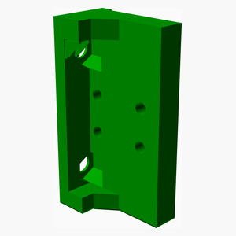
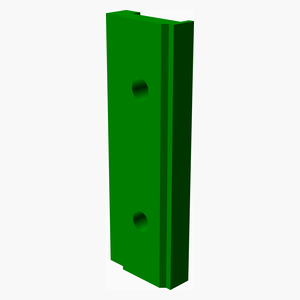

<a name="TOP"></a>
# Ender-3-v3-se-x-linear-rail
This mod replaces the X-axis v slot wheels with an MGN9 linear rail.

If you don't know if you need linear rails on the X-axis then you probably won't benefit from this. But if you
_want_ linear rails like I did, then enjoy.

- **Dimensional accuracy and flow calibration is required in order for the nut trap to fit the nuts securely**.
- [BOM](bom/bom.csv).
  - Either an MGN9C or MGN9H carriage can be used. Ideally use rails with some preload to improve wobble along the Y
  axis.
- Use [Voron print settings](https://docs.vorondesign.com/sourcing.html#print-settings).
  - Probably avoid PLA due to the nut trap only being two walls thick.
- No additional supports required.
- Print STLs in their default orientation.

After installation remember to re-calibrate the Z-offset and recreate the bed mesh.

Measurements and spacers inspired by https://www.printables.com/model/716958-linear-x-rail-mod-ender-3-v3-se. This
version doesn't sacrifice X-axis movement and doesn't need a new endstop. The nozzle sits a bit forward in the Y
axis.

See [results.md](results.md) for input shaper results.

Ender 3 V3 SE reference model taken from
https://www.printables.com/model/672045-ender-3-v3-se-reference-models-step-files.

# Development

Prerequisites:

- https://github.com/nophead/NopSCADlib/tree/master
- https://github.com/revarbat/BOSL

PYTHONPATH is required to generate the BOM with costs:

```bash
PYTHONPATH=$PWD ~/.local/share/OpenSCAD/libraries/NopSCADlib/scripts/make_all.py
```


<span></span>

---
## Table of Contents
1. [Parts list](#Parts_list)
1. [Carriage Assembly](#carriage_assembly)
1. [Linear Rail Assembly](#linear_rail_assembly)
1. [Carriage Rail Assembly](#carriage_rail_assembly)
1. [Toolhead Carriage Assembly](#toolhead_carriage_assembly)

<span></span>
[Top](#TOP)

---
<a name="Parts_list"></a>
## Parts list
| <span style="writing-mode: vertical-rl; text-orientation: mixed;">Carriage</span> | <span style="writing-mode: vertical-rl; text-orientation: mixed;">Linear&nbsp;Rail</span> | <span style="writing-mode: vertical-rl; text-orientation: mixed;">Carriage&nbsp;Rail</span> | <span style="writing-mode: vertical-rl; text-orientation: mixed;">Toolhead&nbsp;Carriage</span> | <span style="writing-mode: vertical-rl; text-orientation: mixed;">TOTALS</span> |  |
|---:|---:|---:|---:|---:|:---|
|  |  |  |  | | **Vitamins** |
| &nbsp;&nbsp;.&nbsp; | &nbsp;&nbsp;7&nbsp; | &nbsp;&nbsp;.&nbsp; | &nbsp;&nbsp;.&nbsp; |  &nbsp;&nbsp;7&nbsp; | &nbsp;&nbsp; Linear rail MGN9 x 300mm |
| &nbsp;&nbsp;.&nbsp; | &nbsp;&nbsp;1&nbsp; | &nbsp;&nbsp;.&nbsp; | &nbsp;&nbsp;.&nbsp; |  &nbsp;&nbsp;1&nbsp; | &nbsp;&nbsp; Linear rail carriage MGN9C |
| &nbsp;&nbsp;.&nbsp; | &nbsp;&nbsp;7&nbsp; | &nbsp;&nbsp;.&nbsp; | &nbsp;&nbsp;.&nbsp; |  &nbsp;&nbsp;7&nbsp; | &nbsp;&nbsp; Nut M3 hammer |
| &nbsp;&nbsp;2&nbsp; | &nbsp;&nbsp;.&nbsp; | &nbsp;&nbsp;.&nbsp; | &nbsp;&nbsp;.&nbsp; |  &nbsp;&nbsp;2&nbsp; | &nbsp;&nbsp; Nut M5 x 4mm  |
| &nbsp;&nbsp;.&nbsp; | &nbsp;&nbsp;.&nbsp; | &nbsp;&nbsp;4&nbsp; | &nbsp;&nbsp;.&nbsp; |  &nbsp;&nbsp;4&nbsp; | &nbsp;&nbsp; Screw M3 cap x  8mm |
| &nbsp;&nbsp;.&nbsp; | &nbsp;&nbsp;7&nbsp; | &nbsp;&nbsp;.&nbsp; | &nbsp;&nbsp;.&nbsp; |  &nbsp;&nbsp;7&nbsp; | &nbsp;&nbsp; Screw M3 cap x 10mm |
| &nbsp;&nbsp;.&nbsp; | &nbsp;&nbsp;.&nbsp; | &nbsp;&nbsp;.&nbsp; | &nbsp;&nbsp;2&nbsp; |  &nbsp;&nbsp;2&nbsp; | &nbsp;&nbsp; Screw M5 wafer head x  4mm |
| &nbsp;&nbsp;.&nbsp; | &nbsp;&nbsp;.&nbsp; | &nbsp;&nbsp;4&nbsp; | &nbsp;&nbsp;.&nbsp; |  &nbsp;&nbsp;4&nbsp; | &nbsp;&nbsp; Washer  M3 x 7mm x 0.5mm |
| &nbsp;&nbsp;2&nbsp; | &nbsp;&nbsp;22&nbsp; | &nbsp;&nbsp;8&nbsp; | &nbsp;&nbsp;2&nbsp; | &nbsp;&nbsp;34&nbsp; | &nbsp;&nbsp;Total vitamins count |
|  |  |  |  | | **3D printed parts** |
| &nbsp;&nbsp;.&nbsp; | &nbsp;&nbsp;1&nbsp; | &nbsp;&nbsp;.&nbsp; | &nbsp;&nbsp;.&nbsp; |  &nbsp;&nbsp;1&nbsp; | &nbsp;&nbsp;left_spacer.stl |
| &nbsp;&nbsp;.&nbsp; | &nbsp;&nbsp;1&nbsp; | &nbsp;&nbsp;.&nbsp; | &nbsp;&nbsp;.&nbsp; |  &nbsp;&nbsp;1&nbsp; | &nbsp;&nbsp;middle_spacer.stl |
| &nbsp;&nbsp;.&nbsp; | &nbsp;&nbsp;1&nbsp; | &nbsp;&nbsp;.&nbsp; | &nbsp;&nbsp;.&nbsp; |  &nbsp;&nbsp;1&nbsp; | &nbsp;&nbsp;right_spacer.stl |
| &nbsp;&nbsp;1&nbsp; | &nbsp;&nbsp;.&nbsp; | &nbsp;&nbsp;.&nbsp; | &nbsp;&nbsp;.&nbsp; |  &nbsp;&nbsp;1&nbsp; | &nbsp;&nbsp;toolhead_carriage_MGN9C.stl |
| &nbsp;&nbsp;1&nbsp; | &nbsp;&nbsp;.&nbsp; | &nbsp;&nbsp;.&nbsp; | &nbsp;&nbsp;.&nbsp; |  &nbsp;&nbsp;1&nbsp; | &nbsp;&nbsp;toolhead_carriage_MGN9H.stl |
| &nbsp;&nbsp;2&nbsp; | &nbsp;&nbsp;3&nbsp; | &nbsp;&nbsp;.&nbsp; | &nbsp;&nbsp;.&nbsp; | &nbsp;&nbsp;5&nbsp; | &nbsp;&nbsp;Total 3D printed parts count |

<span></span>
[Top](#TOP)

---
<a name="carriage_assembly"></a>
## Carriage Assembly
### Vitamins
|Qty|Description|
|---:|:----------|
|2| Nut M5 x 4mm |


### 3D Printed parts

| 1 x toolhead_carriage_MGN9C.stl | 1 x toolhead_carriage_MGN9H.stl |
|---|---|
|  |  


### Assembly instructions


First remove the two supports at the top of the model.


The nuts should be a tight fit. If you have trouble pushing the nut in, check if there is any substantial corner
blobbing due to lack of pressure advance and/or insert an M5 screw from the otherside and tighten.


<span></span>
[Top](#TOP)

---
<a name="linear_rail_assembly"></a>
## Linear Rail Assembly
### Vitamins
|Qty|Description|
|---:|:----------|
|7| Linear rail MGN9 x 300mm|
|1| Linear rail carriage MGN9C|
|7| Nut M3 hammer|
|7| Screw M3 cap x 10mm|


### 3D Printed parts

| 1 x left_spacer.stl | 1 x middle_spacer.stl | 1 x right_spacer.stl |
|---|---|---|
|  |  |  


### Assembly instructions


Attach the spacers to the assembly, taking note that the left spacer is offset by one screw hole.

Remember to clean and lubricate both the carriage and rail.


<span></span>
[Top](#TOP)

---
<a name="carriage_rail_assembly"></a>
## Carriage Rail Assembly
### Vitamins
|Qty|Description|
|---:|:----------|
|4| Screw M3 cap x  8mm|
|4| Washer  M3 x 7mm x 0.5mm|


### Sub-assemblies

| 1 x carriage_assembly | 1 x linear_rail_assembly |
|---|---|
|  |  


### Assembly instructions


Attach the carriage to the rail. Note that the front two screws won't be easily accessible once the PCB is mounted.


<span></span>
[Top](#TOP)

---
<a name="toolhead_carriage_assembly"></a>
## Toolhead Carriage Assembly
### Vitamins
|Qty|Description|
|---:|:----------|
|2| Screw M5 wafer head x  4mm|


### Sub-assemblies

| 1 x carriage_rail_assembly |
|---|
|  


### Assembly instructions


Screw the frame into the carriage, ensuring that the frame is flush on the carriage. Remember to insert the belts
before re-assembling the everything else.


<span></span>
[Top](#TOP)
