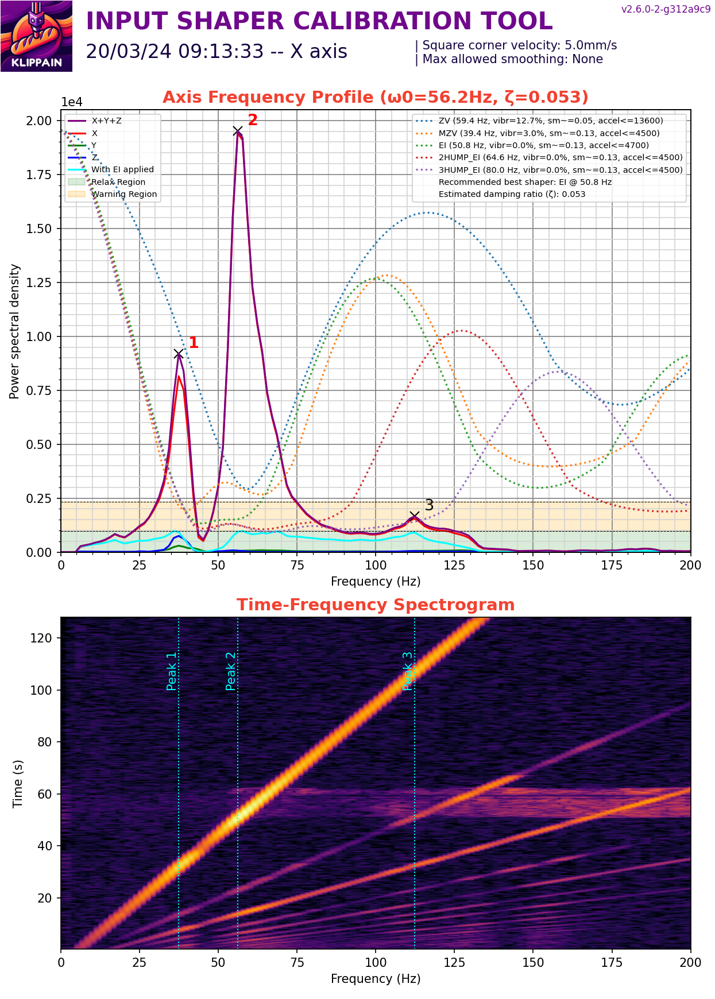
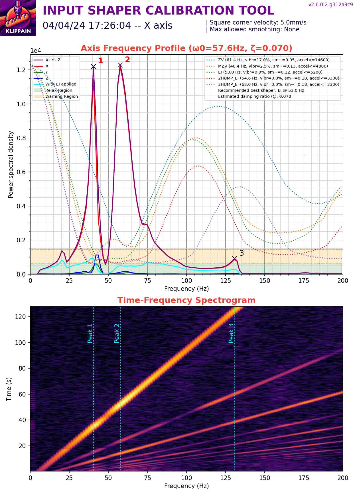
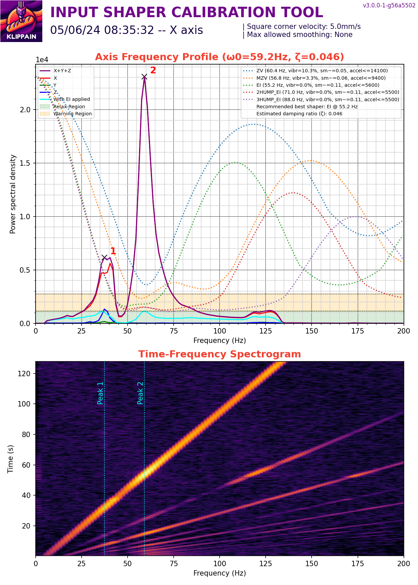
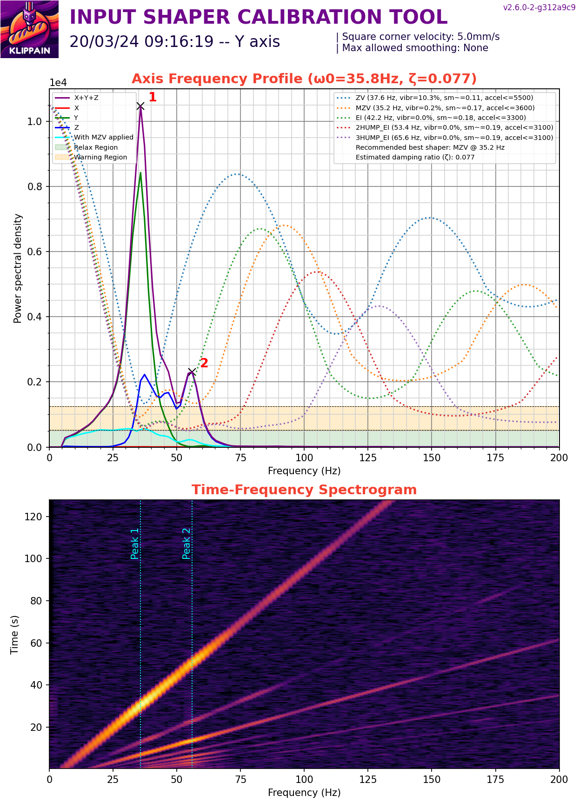
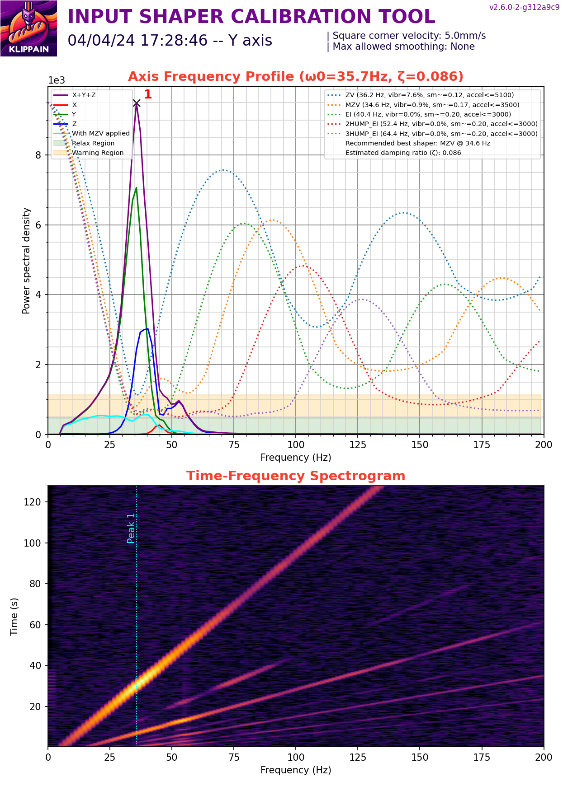
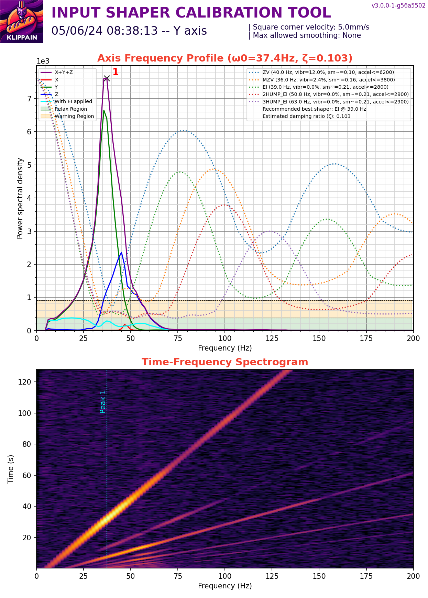

# Results

My two SEs are almost identical with the following mods:

- Linear y rails
- Dual 5015 fans
- Low profile 40mm fan mount

The linear Y rails are cheap ones from Aliexpress with enough preload to prevent them from sliding by themselves. 

The linear X rails used are MGN9C and have next to no preload with so the carriage able to slide down the rail without any other force except for gravity. There is a bit of Y axis movement from the toolhead due to the rail carriage moving and not (as far as I can tell) the printed parts.

# V1

|Axis|Printer 1|Printer 2|
|---|---|---|
|X||
|Y|||

# V2

V2 lowers the rail a little bit and adds a groove into the spacers to allow the rail to settle in the groove a little better.

There seems to be less vibrations on the X axis though I can't say that the belt tension is the same. The double peak resonances remain. The toolhead wobbles a less under my touch, but I can definitly feel the carriage having some play.

I purchased some MGN9H rails which have little to no preload and moves down the rail without any external forces. I tried my luck with a second set of rails, one of which has enough preload to prevent the carriage from sliding on its own.

I did the following experiments in this order:

- Using the V1 Backplate from https://www.printables.com/model/716958-linear-x-rail-mod-ender-3-v3-se. Used V1 because I already had that printed.
- Using V2 on MGN9C, replaced the Y motor with a same model, changed the Y pully to 30T, and trammed the linear Y rails more carefully.
- Using V2 on a no-preloaded MGN9H.
- Using V2 on a preloaded MGN9H.

I did not control for belt tension and other variables, so these graphs should reflect the general trends/order of magnitude estimates of vibrations and not a 1-to-1 comparison.

|Axis|Ben's V1|V2 MGN9C|V2 MGN9H no preload|V2 MGN9H preloaded|
|---|---|---|---|---|
X||||
Y||||

On the X axis all of the graphs are on the same order of magnitude, with the results improving with the MGN9H and improving again with the preloaded rail. With a max accel of ~5600 mm/s^2 this matches similar results I had using the V-slot wheels.

Tramming the Y rails has improved the second peak, though the vibrations on the last result is significantly higher.