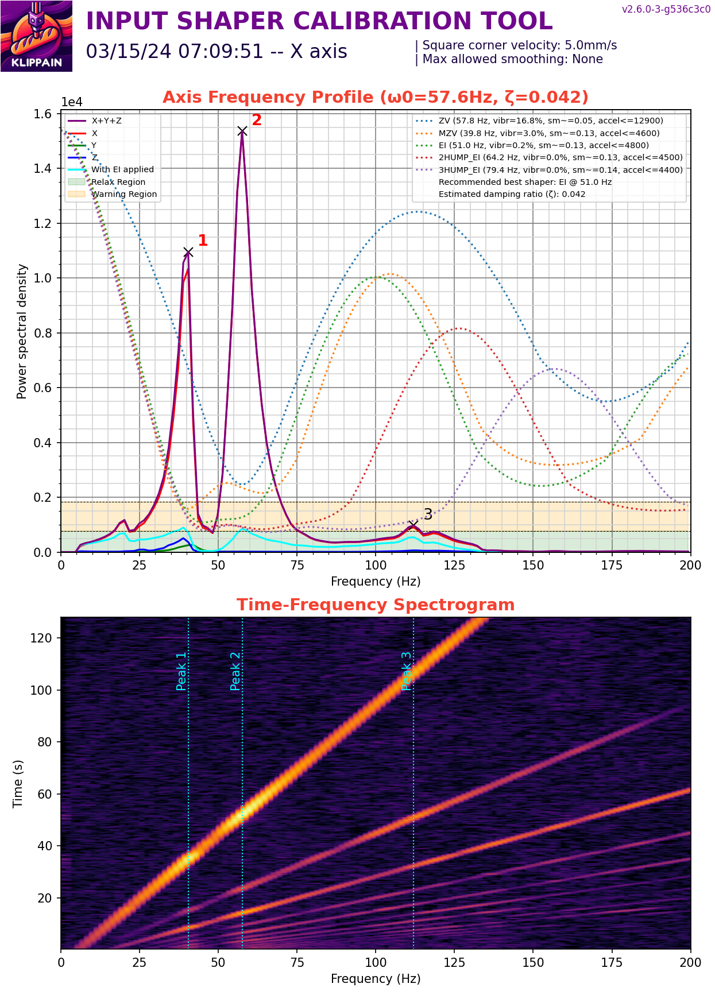
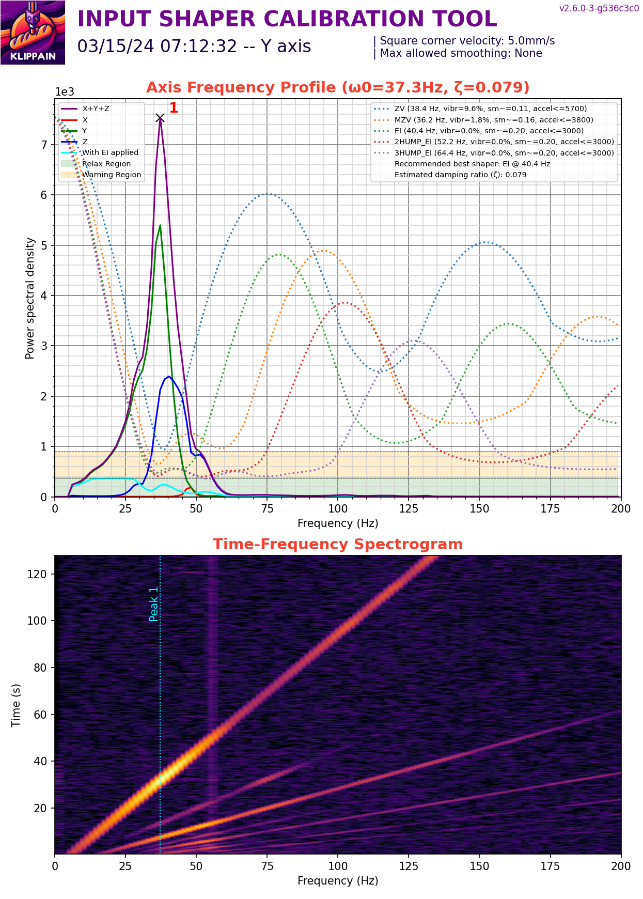
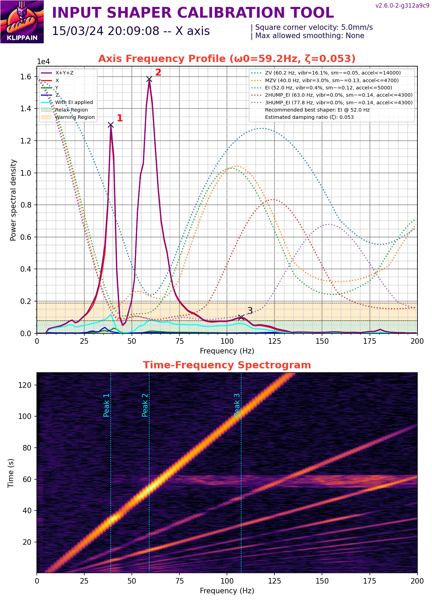

# Results

My two printers are almost identical with the following mods:

- Linear y rails
- Dual 5015 fans
- Low profile 40mm fan mount

The linear Y rails are cheap ones from Aliexpress with some preload on them. 

The linear X rails have next to no preload with the carriage able to slide down the rail without any other force except for gravity. There is a bit of Y axis movement from the toolhead due to the rail carriage moving and not (as far as I can tell) the printed parts.

## Printer 1

## Printer 2

