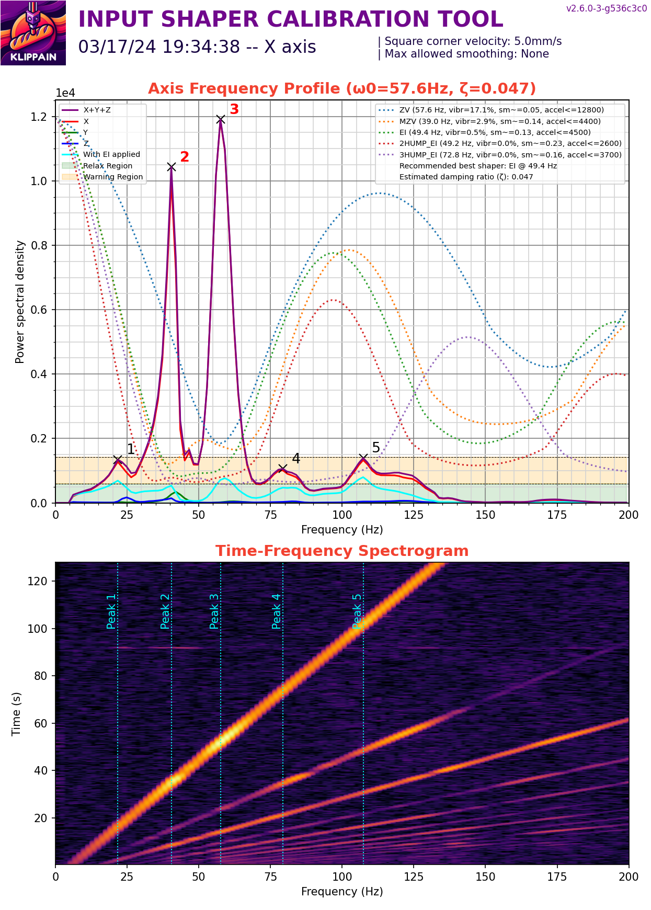

# Results

My two SEs are almost identical with the following mods:

- Linear y rails
- Dual 5015 fans
- Low profile 40mm fan mount

The linear Y rails are cheap ones from Aliexpress with some preload on them. 

The linear X rails have next to no preload with the carriage able to slide down the rail without any other force except for gravity. There is a bit of Y axis movement from the toolhead due to the rail carriage moving and not (as far as I can tell) the printed parts.

# V1

## Printer 1

## Printer 2

# V2

V2 lowers the rail a little bit and adds a groove into the spacers to allow the rail to settle in the groove a little better.

There seems to be less vibrations on the X axis though I can't say that the belt tension is the same. The double peak resonances remain. The toolhead wobbles a less under my touch, but I can definitly feel the carriage having some play.

